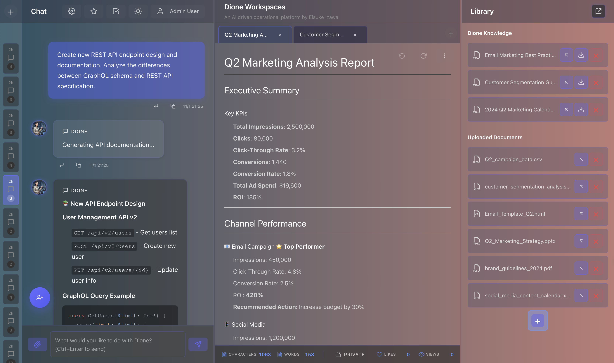
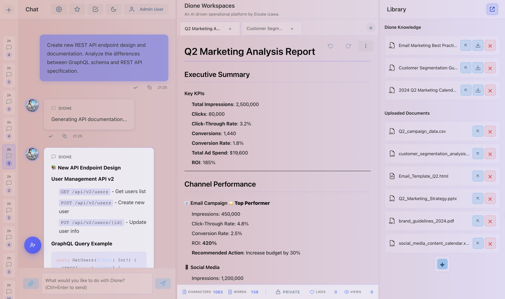
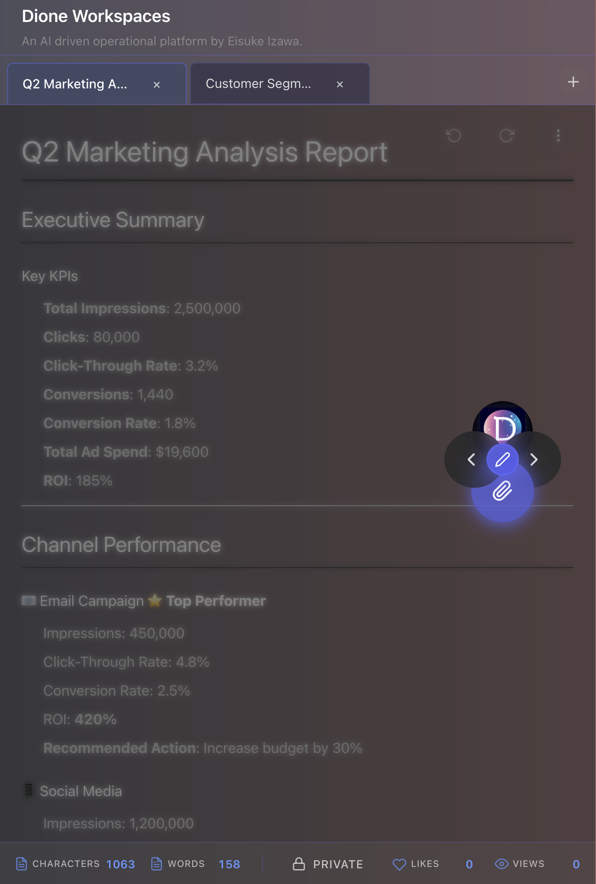
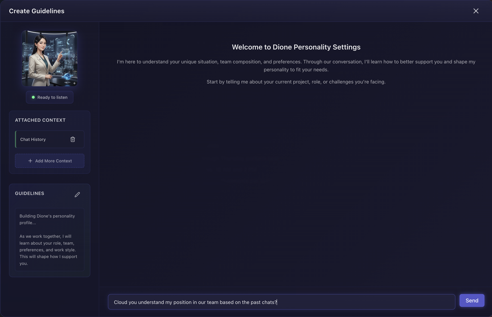
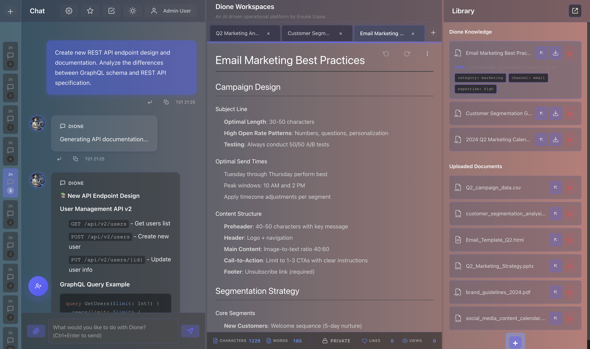
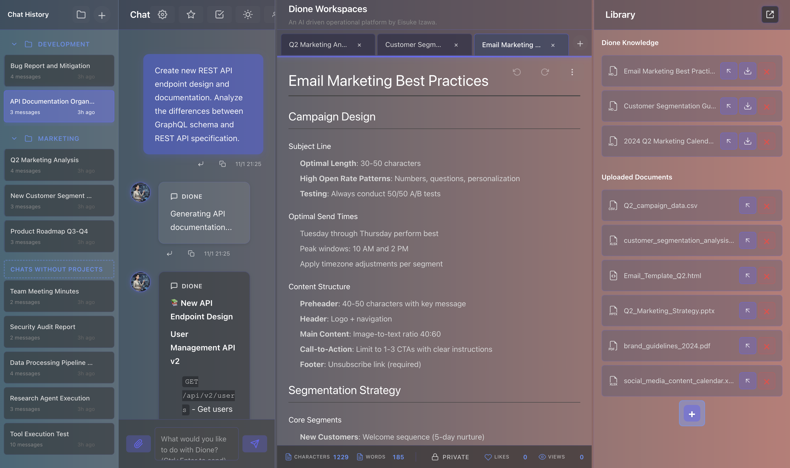
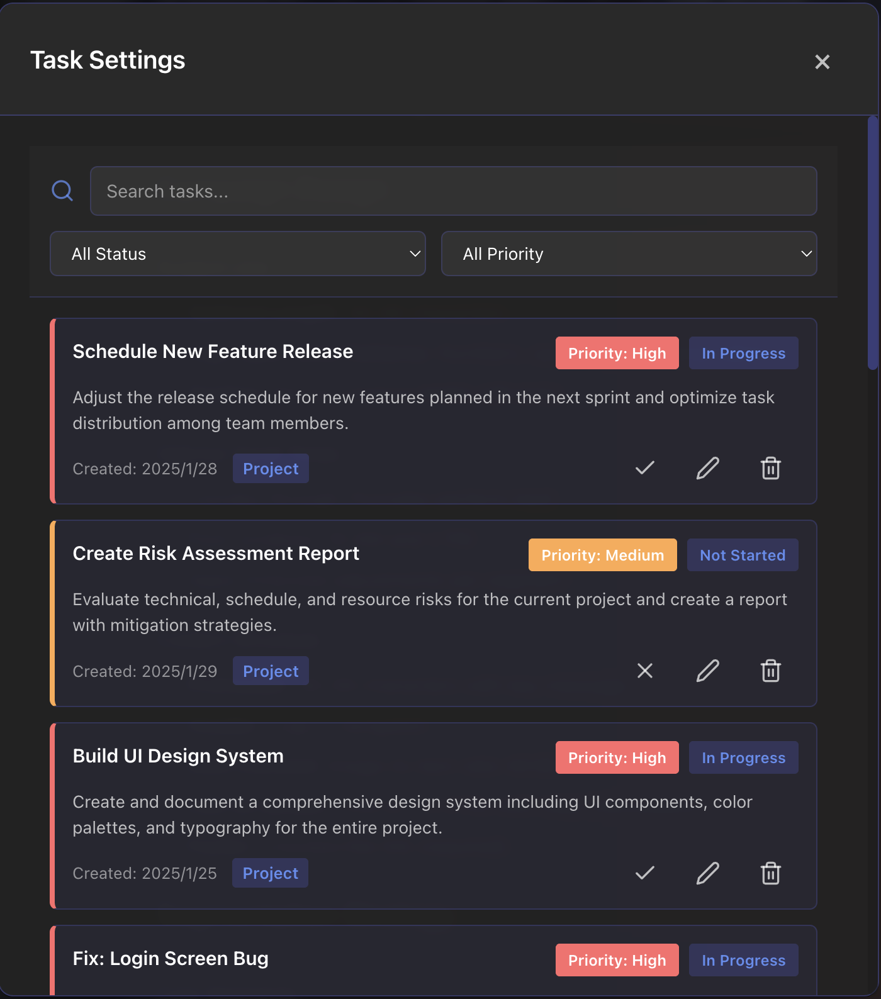
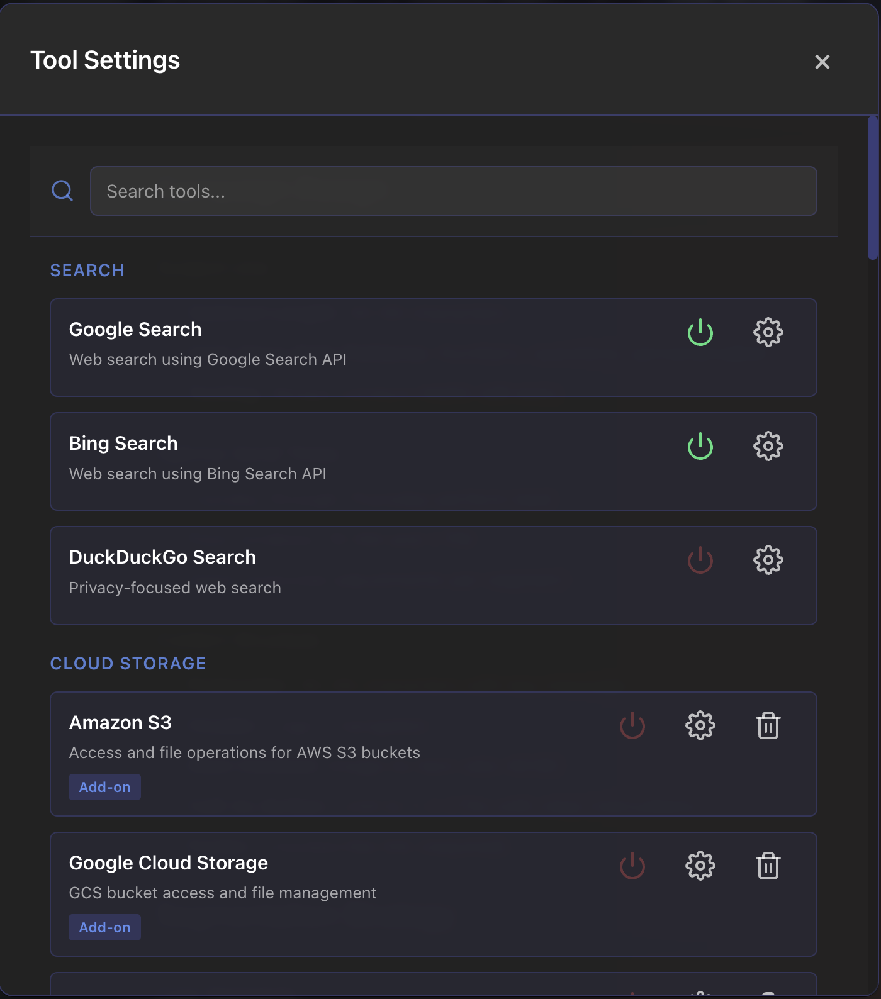
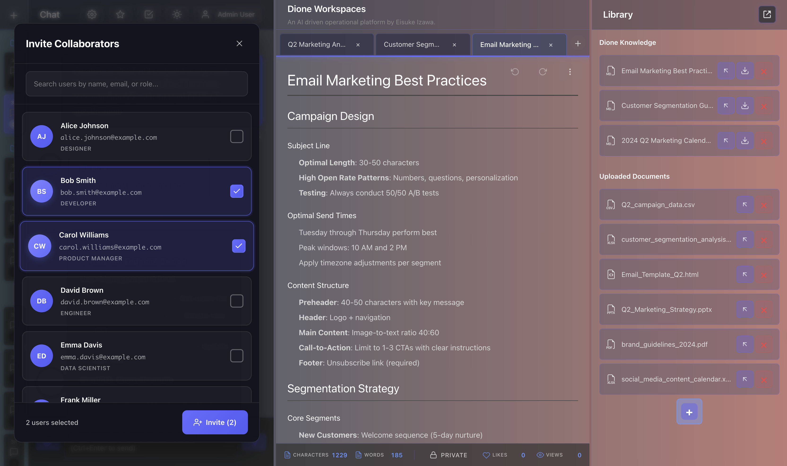
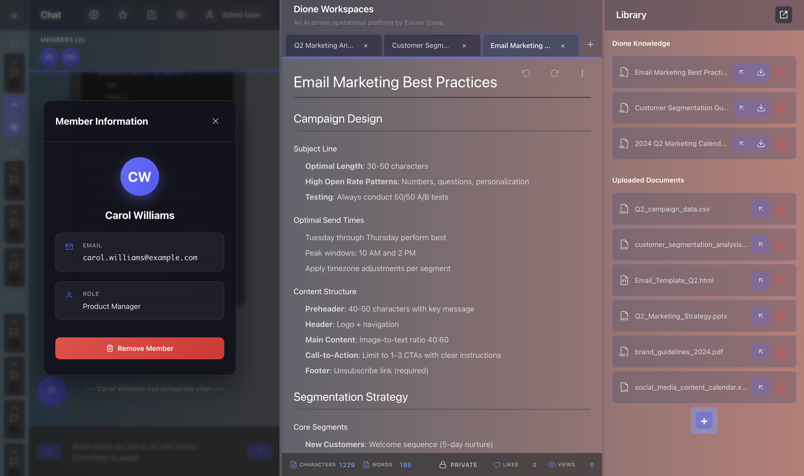

# Gamen (画面)

マルチエージェントAIワークフロー向けの**アーティファクトファースト設計**を探求するUIモックアップです。Gamenは4つのコア paradigmを実装しています:

1. **アーティファクトファースト画面** — AIの出力とアーティファクトを一時的なチャットではなく第一級市民として扱う
2. **自動エージェントプロンプト更新** — ガイドラインのリアルタイム編集によるエージェントの動的再設定
3. **ユーザー主導のツール・タスク管理** — ツール実行とタスク調整の明示的なユーザーコントロール
4. **ナレッジベース統合** — コンテキスト情報のための統一ドキュメントライブラリ

React 19、Zustand、Framer Motionで構築。Dioneのワークスペース概念にインスパイアされています。MIT License。

---

## 🎯 哲学

### アーティファクトファースト画面

ワークスペースはAIの出力を**永続的なアーティファクト**として、一時的なメッセージではなく扱います:

- **思考トレース**: ステップバイステップのAI推論と実行の詳細
- **ツール実行ログ**: ツール引数、結果、エラートレース、タイムスタンプ
- **協調的アーティファクト**: バージョン管理と公開機能付きMarkdownスクラッチパッド
- **文脈情報**: デュアルソースドキュメントライブラリ（ナレッジベース＋ユーザーアップロード）

すべてのアーティファクトはワークスペース内に常時表示され、永続的な文脈を作成します。

### 自動エージェントプロンプト更新

エージェントは静的ではありません。**ガイドラインエディタ**はリアルタイムなエージェント再設定を可能にします:

- エージェントのシステムプロンプトを再起動なしで編集・確認
- ツール利用可能性とタスクパラメータをその場で変更
- 変更は進行中の会話に即座に適用
- ガイドライン履歴で設定の進化を追跡

### ユーザー主導のツール・タスク管理

ユーザーはAI操作全体を通じてコントロールを維持します:

- **タスク統合**: チャット内の@mentionsでタスク作成・管理・参照
- **明示的なツール選択**: エージェントがアクセス可能なツールを設定
- **双方向リンク**: タスクと会話は同期
- **タスクパネル**: 優先度とステータスでタスクを表示・検索・フィルター

ユーザーはエージェント動作をガイドします。エージェントは人間の判断を補強し、決して置き換えません。

### ナレッジベース統合（ライブラリパネル）

文脈情報は統一されアクセス可能です:

- **デュアルソースドキュメント**: 1つのパネルにナレッジベースとユーザーアップロード
- **多型プレビュー**: Markdown、PDF、Excel、Word、画像、コード—すべてインラインで表示
- **リッチメタデータ**: カテゴリー、フレームワーク、レベル、ソース、アップロード時刻
- **ドラッグ&ドロップ**: チャットやスクラッチパッドへ即座に追加
- **アタッチメント継続性**: ドキュメントはメッセージにリンク

知識は常に手の届く範囲にあります—ワークスペース内の会話と共に存在します。

---

## 🎬 ビジュアルオーバービュー

### 3パネルワークスペースアーキテクチャ

統一されたワークスペースはチャット、アーティファクト、知識を1つの調整された環境に統合します:

**ダークモード** — 光るテック要素を持つ夜空


**ライトモード** — 漂う雲のある昼空


### アーティファクトファーストスクラッチパッド

すべてのスクラッチパッドアーティファクトはバージョン管理、ライブ統計（文字・単語数、エンゲージメント指標）、クイックアクション用の円形アーティファクトコントローラーを備えています:



公開されたアーティファクトは各スクラッチパッドの下部にリアルタイムアニメーション統計でエンゲージメントを追跡します。

### 自動エージェントプロンプト更新

ガイドラインエディタは会話を再開することなくエージェントの動的再設定を可能にします:



ユーザーはシステムプロンプト、タスクパラメータ、ガイドラインを編集します。変更は進行中の会話に即座に適用され、リアルタイムなエージェント動作適応を実現します。

### ナレッジベース統合

ライブラリパネルはAI知識とユーザーアップロードをリッチメタデータタグ（カテゴリー、チャネル、専門知識レベル、ソース、タイムスタンプ）で統一します:



ドキュメントはドラッグ&ドロップでチャットやスクラッチパッドに容易にアクセスでき、文脈情報を常に手の届く範囲に保ちます。

### プロジェクト組織・チャット履歴

チャットサイドバーはプロジェクトと組織化された会話を表示し、ユーザーが関連するチャットをグループ化して会話文脈を維持できるようにします:



### ユーザー主導のタスク管理

タスク設定モーダルはタスクの包括的な検索、ステータスと優先度によるフィルタリング、プロジェクト関連付け付きの詳細なタスク説明を提供します:



ユーザーはワークスペース内からタスクを検索、フィルター、完了マーク、編集、削除できます。

### 明示的なツール設定

ツール設定モーダルはカテゴリ（検索、クラウドストレージなど）ごとに整理された利用可能なツールを表示し、有効化/無効化トグルと個別のツール設定を備えています:



ユーザーはエージェントがアクセスできるツールを明示的に選択し、能力を完全にコントロール保有します。

### 協調的ワークスペース

名前、メール、ロールでユーザーを検索して協力者を招待:



メール、ロール、メンバーシップ管理を含む詳細情報でチームメンバーを表示・管理:



ワークスペースはチームメンバーとのリアルタイム協力、透明なメンバー管理、ロールベースの組織をサポートします。

---

## ✨ 機能

### 🗨️ チャットパネル

- **複数チャットセッション**と永続メッセージ履歴
- **リッチメッセージタイプ**:
  - **標準レスポンス**（フルMarkdownと構文ハイライト）
  - **思考トレース**（ステップバイステップの推論と実行詳細）
  - **ツール実行ログ**（引数、結果、エラートレース、タイムスタンプ付き）
  - **システムメッセージ**（協調イベントとステータスアップデート）
- **対話型詳細モーダル** — 推論、ツール引数、エラーログを検査
- **タスク@mentions** — チャット内でインラインでタスクを参照（オートコンプリート）
- **ファイルアタッチメント** — 画像、ドキュメント、メディアのプレビュー
- **返信スレッド** — 特定メッセージの引用・参照
- **テーム切り替え** — アニメーション暗いテーマと明るいテーマを切り替え

### 📝 スクラッチパッド（アーティファクトエディタ）

- **マルチタブMarkdownエディタ**と完全な編集/プレビューモード
- **タブごとのアンドゥ/リドゥ履歴**と視覚ナビゲーション
- **公開システム** — エンゲージメント追跡付きメモ公開（ビュー、いいね、シェア）
- **ライブ統計** — アニメーション遷移付きリアルタイム文字・単語数
- **ダウンロード出力** — ローカルにMarkdownコンテンツを保存
- **ドキュメント統合** — スクラッチパッドにドラッグしてアノテーション
- **完全Markdownサポート** — テーブル、リスト、コードブロック、構文ハイライト

### 📚 ドキュメントライブラリ（ナレッジパネル）

- **デュアルソースドキュメント管理**:
  - ナレッジベースドキュメント（AI参照）
  - ユーザーアップロードファイル（PDF、Excel、Word、画像、コード、テキスト、Markdown）
- **フォーマットサポート**:
  - **Markdown**: ネイティブレンダリングと構文ハイライト
  - **PDF**: インラインiframeプレビュー
  - **Excel**: HTMLテーブル変換
  - **Word**: Mammoth経由のHTMLレンダリング
  - **画像、コード、テキスト**: 適切なスタイリングでの直接レンダリング
- **メタデータタグ** — カテゴリー、フレームワーク、レベル、ソース、アップロード時刻
- **ファイル操作** — ドラッグ&ドロップでのアップロード、ダウンロード、削除
- **プレビューモーダル** — 全画面ドキュメント表示

### ⚙️ ガイドラインエディタ（エージェント設定）

- エージェントシステムプロンプトと指示を編集
- タスクテンプレートとパラメータを設定
- ツール利用可能性と設定を管理
- 変更は進行中の会話に即座に適用

### 🎨 テーマ・UI

- **アニメーションテーマ**:
  - **ダーク**: 光るアクセントと瞬く星を持つ夜空
  - **ライト**: 漂う雲のある昼空
- **リサイズ可能なマルチパネルレイアウト** — プロフェッショナルなパネルコントロールとスムーズ遷移
- **Framer Motionアニメーション** — スプリングベースモーダルオープン、カウンターアニメーション、アイコンコレオグラフィー
- **カスタムスタイリング** — フロストグラス効果、カスタムスクロールバー、テーマ対応コンポーネント
- **レスポンシブ設計** — 異なるスクリーンサイズに適応

---

## 🛠 テックスタック

**フロントエンド**: React 19、Vite
**状態管理**: ZustandとlocalStorage永続化、Redux DevTools
**レンダリング**: React Markdown（GFM、構文ハイライト）、Mammoth（DOCX）、XLSX（Excel）
**UI・アニメーション**: Framer Motion、react-resizable-panels、Radix UI、Tailwind CSS v4、React Icons
**スタイリング**: コンポーネントスコープCSSモジュールと高度なアニメーション

---

## 🚀 はじめ方

```bash
# 依存関係をインストール
npm install

# 開発サーバーを起動
npm run dev
```

ブラウザで`http://localhost:5173`を開きます。

**デモ認証情報:**
- メール: `demo@example.com`
- パスワード: `demo123`

---

## 📁 プロジェクト構成

```
ai-workspace-app/
├── src/
│   ├── components/        # UIコンポーネント
│   │   ├── ChatPanel.jsx
│   │   ├── Scratchpad.jsx
│   │   ├── DocumentPanel.jsx
│   │   ├── MessageDetailModal.jsx
│   │   ├── TasksPanel.jsx
│   │   ├── FilePreview.jsx
│   │   └── ... (その他モーダルとパネル)
│   ├── store/            # Zustandストア
│   │   ├── useChatStore.ts
│   │   ├── useThemeStore.ts
│   │   ├── useAuthStore.ts
│   │   ├── useProjectStore.ts
│   │   ├── useWorkspaceStore.ts
│   │   └── useTaskStore.ts
│   ├── types/            # TypeScriptインターフェース
│   ├── utils/            # ユーティリティ関数（ファイルタイプ検出など）
│   ├── App.jsx           # リサイズ可能パネル付きメインレイアウト
│   ├── App.css           # グローバルテーマアニメーション
│   └── index.css         # ベーススタイル
├── public/               # 静的アセット
└── package.json          # 依存関係
```

---

## 💡 設計哲学

Gamenは**マルチエージェントAIワークフロー向けのUX paradigmを探求するワーキングプロトタイプ**であり、本番アプリケーションではありません。以下の問いを投げかけます:

- **アーティファクトが第一級市民だったら?** チャット履歴に埋もれるのではなく、永続的かつアクセス可能。
- **エージェントが動的に再設定可能だったら?** デプロイメント時に固定ではなく、ガイドライン編集を通じた適応。
- **ユーザーが明示的にコントロールできたら?** エージェント自律性に隠れるのではなく、タスク・ツール管理で可視化。
- **知識が常にアクセス可能だったら?** ツール全体に分散するのではなく、ワークスペース内に統一。

これらは設計上の問いであり、最終的な答えではありません。Gamenは人間-AI協力の1つの可能なアプローチを実装しています。

---

## 📜 ライセンス

MIT License — LICENSE ファイルを参照してください。

**注**: Gamenはdione ワークスペース概念にインスパイアされています（© Dione商用プロジェクト）。GamenはこれらのコンセプトをMIT Licenseの下で実装しています。「Dione」の名称と関連ブランディングは各所有者の財産です。
